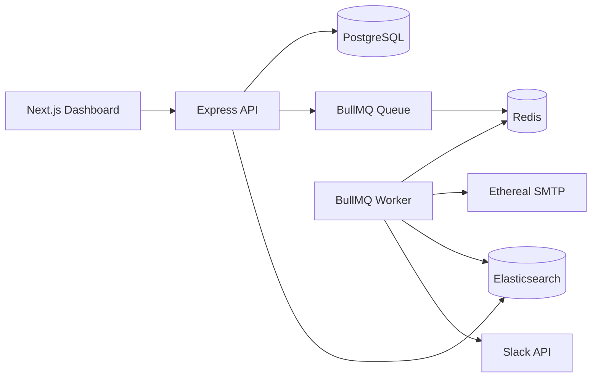

# ReachInbox Email Scheduler

Production-style **email scheduling service + dashboard** for the Outbox Labs assignment: Express + BullMQ + Redis, PostgreSQL, Elasticsearch, Ethereal SMTP, Google OAuth, and Slack rate-limit alerts.

## Architecture



- **Scheduling:** BullMQ **delayed jobs** (`delay = scheduledAt - now`). No cron.
- **Persistence:** Jobs live in Redis; email rows in Postgres. On startup, `recoverPendingJobs()` re-adds DB rows that have no BullMQ job (e.g. Redis flush).
- **Idempotency:** BullMQ `jobId = emailJobId`; a conditional DB status claim prevents two workers from sending the same row. A crash after SMTP accepts a message but before Postgres records `SENT` is inherently ambiguous because SMTP offers no idempotency key; startup marks interrupted `SENDING` rows failed for review rather than blindly resending and risking duplicates.

## Rate limiting & throughput

| Setting | Env var | Default |
|--------|---------|---------|
| Worker concurrency | `WORKER_CONCURRENCY` | `5` |
| Min delay between sends | `MIN_DELAY_BETWEEN_SENDS_MS` | `2000` (2s) |
| Global emails / hour | `MAX_EMAILS_PER_HOUR` | `200` |
| Per-sender emails / hour | `MAX_EMAILS_PER_HOUR_PER_SENDER` | `50` |

**Enforcement (Redis, safe across workers/instances):**

1. Before send, a Redis Lua script atomically checks and increments `rate:global:{YYYYMMDDHH}` and `rate:sender:{email}:{YYYYMMDDHH}` (UTC hour windows, 2h TTL).
2. If over limit, counters are rolled back, **`job.moveToDelayed(nextHour)`** runs (jobs are **not dropped**), and Slack is notified once per user/sender/reason/hour.
3. BullMQ's Redis-backed queue limiter (`max: 1` per `MIN_DELAY_BETWEEN_SENDS_MS`) spaces sends across worker instances; configured concurrency controls parallel job processing while the limiter serializes SMTP starts.

**Load (1000+ jobs at same time):** Jobs become active as delays expire; concurrency + min-delay throttle SMTP; hourly caps delay overflow into the next UTC hour while preserving FIFO per queue as much as BullMQ ordering allows.

## Prerequisites

- Node.js 20+
- Docker (for Postgres, Redis, Elasticsearch)

## Quick start

```bash
# 1. Infrastructure
docker compose up -d

# 2. Backend
cd backend
cp .env.example .env
# Fill GOOGLE_* and optionally SLACK_*
npm install
npx prisma db push
npm run dev

# 3. Frontend (new terminal)
cd frontend
cp .env.example .env.local
npm install
npm run dev
```

- App: http://localhost:3000  
- API: http://localhost:4000  
- **Bull Board:** http://localhost:4000/admin/queues (Google-authenticated)

## OAuth setup

### Google (required)

1. [Google Cloud Console](https://console.cloud.google.com/) → OAuth client (Web).
2. Authorized redirect URI: `http://localhost:4000/api/auth/google/callback`
3. Set `GOOGLE_CLIENT_ID`, `GOOGLE_CLIENT_SECRET` in `backend/.env`.

### Slack (rate-limit notifications)

1. Create a Slack app → OAuth & Permissions → redirect URL `http://localhost:4000/api/slack/callback`
2. Bot scopes: `chat:write`, `im:write`, `users:read`
3. Set `SLACK_CLIENT_ID`, `SLACK_CLIENT_SECRET` in `backend/.env`.
4. In the dashboard, click **Connect Slack**. When a sender hits the hourly cap, the app posts a DM via `chat.postMessage`.

## API (authenticated with `Authorization: Bearer <jwt>`)

| Method | Path | Description |
|--------|------|-------------|
| GET | `/api/auth/google` | Start Google login |
| POST | `/api/emails` | Schedule email |
| GET | `/api/emails?status=scheduled\|sent` | List emails |
| GET | `/api/search?q=` | Elasticsearch search |
| GET | `/api/slack/connect` | Slack OAuth URL |
| GET | `/api/me/limits` | Show configured limits |

## Demo checklist

1. Login with Google → dashboard with name, email, avatar.
2. Compose → schedule email → appears under **Scheduled**; after send, under **Sent** with Ethereal preview link.
3. Restart API → future sends still fire (Redis + DB recovery).
4. Lower `MAX_EMAILS_PER_HOUR_PER_SENDER=2`, schedule 3+ emails → jobs delay to next hour; Slack message if connected.
5. Open Bull Board to inspect queue state.
6. Search bar hits Elasticsearch index.

## Project structure

```
backend/     Express, BullMQ worker, Prisma, ES, Slack
frontend/    Next.js 14 + Tailwind dashboard (Figma-inspired layout)
docker-compose.yml
```

## Trade-offs

- Hourly windows use **UTC** for simple Redis keys; production might use tenant timezone.
- Ethereal creates **one SMTP account per (user, fromEmail)** for multi-sender demos.
- Bull Board is open in dev; restrict in production (auth / network).

---

Built for ReachInbox / Outbox Labs hiring assignment.
